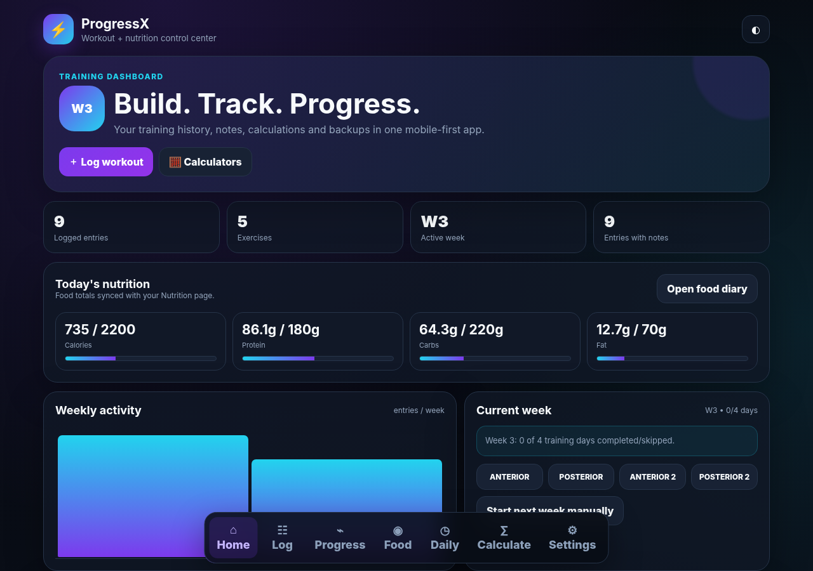
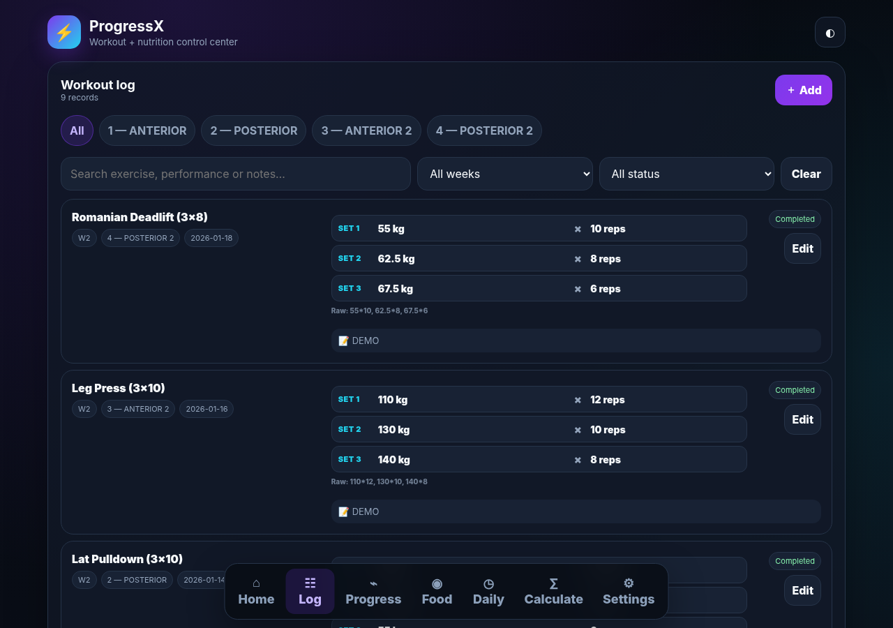
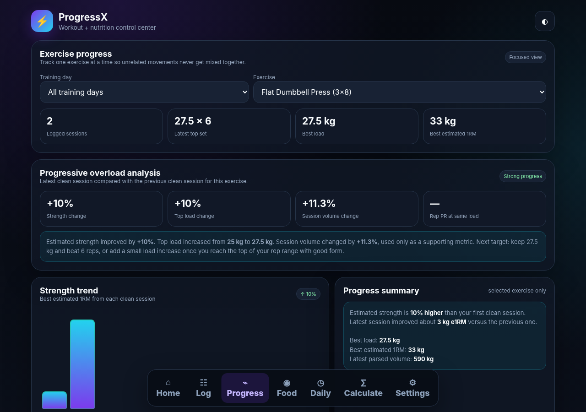
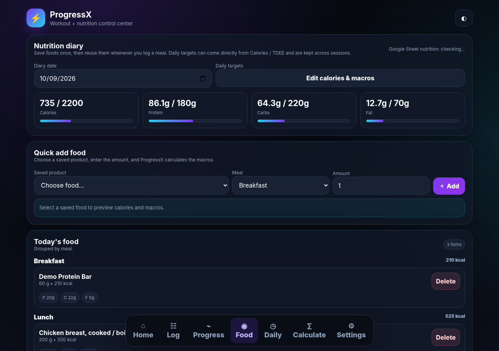
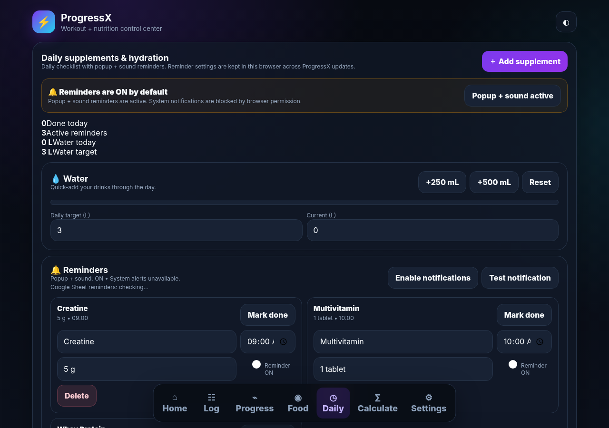
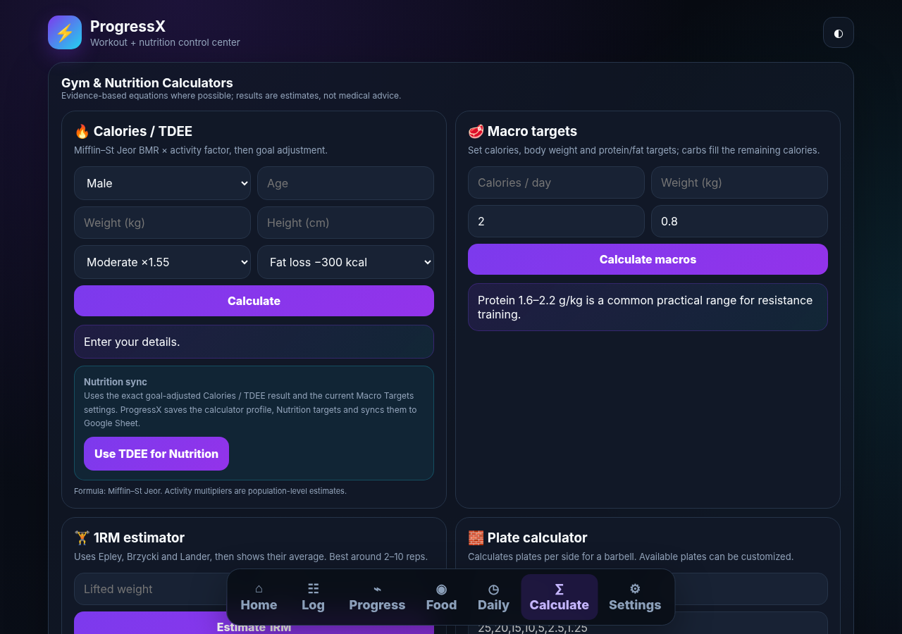
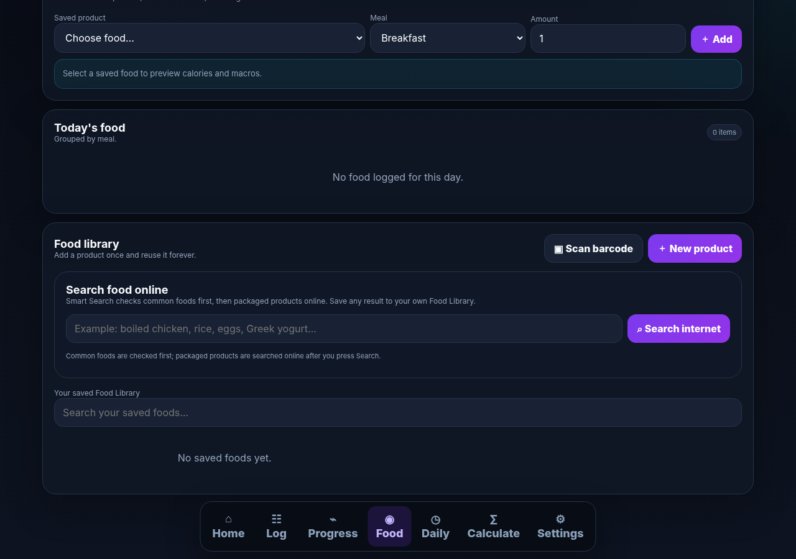
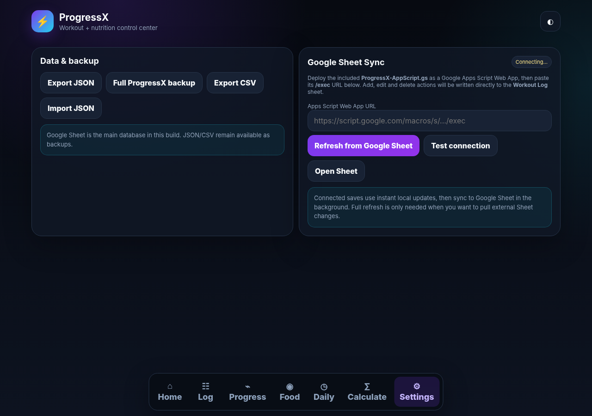

<div align="center">


# ProgressX
### Train. Track. Progress.

A personal workout, progressive-overload, nutrition, reminder and fitness-calculator tracker that can run as a local web app or Android APK.

[](https://github.com/OWNER/REPO/actions/workflows/android-build.yml)

</div>

> **Template repository:** no private workout history is included. The Excel template contains only clearly marked demo rows.

## What is inside

- Workout logging with raw set notation (`25*7, 27.5*6, 30*6`)
- Progressive-overload analysis and estimated 1RM trends
- Nutrition diary with calories, protein, carbs and fat
- Food Library, barcode lookup and Smart Food Search
- Daily supplement + water reminders
- TDEE, macros, BMI, 1RM, volume and hydration calculators
- Google Sheets + Apps Script sync
- Android WebView wrapper with camera permission support
- GitHub Actions workflow that builds an APK in the cloud

## App tour

| Home | Workout Log | Progress |
|---|---|---|
|  |  |  |

| Food | Daily | Calculators |
|---|---|---|
|  |  |  |

### Smart Food Search



| Settings |
|---|
|  |

## Quick start

1. Download or clone this repository.
2. Upload `template/ProgressX-Template-Demo.xlsx` to Google Drive and convert it to Google Sheets.
3. Open **Extensions → Apps Script** and paste `backend/Code.gs` plus `backend/appsscript.json`.
4. Run `testProgressXPermissions()` once.
5. Deploy the script as a Web App: **Execute as Me / Anyone**.
6. Open `web/ProgressX.html` → **Settings** → paste your `/exec` URL.

Full instructions: **[docs/SETUP.md](docs/SETUP.md)**

## Build the Android APK without Android Studio

This repo includes `.github/workflows/android-build.yml`.

1. Open **Actions** in GitHub.
2. Select **Build ProgressX APK**.
3. Click **Run workflow**.
4. When the run is green, open it and download the **ProgressX-APK** artifact.
5. Extract `app-debug.apk` and install it on Android.

## Repository structure

```text
ProgressX/
├── .github/workflows/android-build.yml
├── android/                 # Android Studio / Gradle project
├── assets/                  # icon + promo artwork
├── backend/                 # Google Apps Script backend + manifest
├── docs/SETUP.md
├── screenshots/             # screenshots for each main app option
├── template/ProgressX-Template-Demo.xlsx
├── web/ProgressX.html
├── LICENSE
└── README.md
```

## Template data

The workbook uses the same sheet names expected by ProgressX:

- `Workout Log`
- `Program`
- `Reminders`
- `Daily Log`
- `Food Products`
- `Food Log`
- `Nutrition Settings`

Demo rows are there only to show the expected format. There is **no personal workout or nutrition history** in the template.

## Privacy

ProgressX does not require a shared central database. Each person can make their own Sheet and Apps Script deployment, keeping their tracker separate from other users.

## License

MIT
